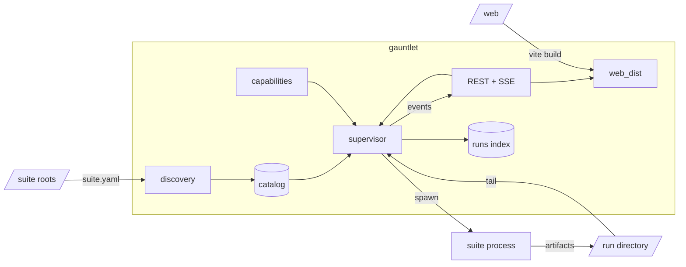

# Architecture

Gauntlet contains no suite-specific code. A suite describes itself in its
`suite.yaml`; the results it produces are a directory of files.

## Components

| Module | Responsibility |
|---|---|
| `gauntlet.suites` | Walks the suite roots, loads and validates each `suite.yaml`, lists profiles. |
| `gauntlet.supervisor` | Builds the command line, spawns the process, streams output, finalizes the run. |
| `gauntlet.capabilities` | Registers instrument providers and grants them to runs. Ships `MockChamber`, `MockDaq` and `MockPsu`. |
| `gauntlet.conformance` | Checks a suite against the contract. |
| `gauntlet.storage` | SQLite behind `RunsIndex` (run history), `NotesIndex` (operator notes on runs and units), and `UnitsIndex` (units, aggregated from the runs table). One database file. |
| `gauntlet.api` | REST routers, one module per resource: `system`, `suites`, `runs`, `artifacts`, `units`, `instruments`. `notes` is shared plumbing rather than a router; `host_stats` reads the host. |
| `gauntlet.app` | Wires all of it onto `app.state`, mounts the routers under `/api`, and serves `web_dist` at `/`. |

`gauntlet.api.host_stats` reads `/proc`, `/sys`, `os` and `shutil` only. It adds
no dependency, and every reader answers `None` or an empty list where the kernel
does not offer the file.

A unit is not a record an operator creates: it exists because runs name it, and
its counters are an aggregate over the `runs` table. The `units` table holds only
the metadata that has to outlive those rows, so forgetting a unit never loses run
history. Renaming rewrites `unit_serial` on the run rows, so history follows the
unit.

## Run lifecycle

1. The supervisor resolves the suite from the catalog and the profile from the
   suite's profile directory and the user profile directory.
2. Every entry in the suite's `requires:` list is checked against the
   capability registry. An unsatisfiable capability rejects the run.
3. Gauntlet creates `<runs>/<suite>/<run-id>/` and passes it as
   `GAUNTLET_RUN_DIR`.
4. Argv is assembled from `exec.command`, `exec.args`, and the declared
   overrides supplied with the request.
5. The process is spawned. Two threads run: one reads stdout into `test.log`
   and the event bus, one tails `metrics.jsonl`.
6. On exit, `verdict.json` determines the outcome, the event bus publishes it,
   and the run is written to the index.

An unknown suite, a missing profile, an undeclared override, or an
unsatisfiable capability rejects the request before anything is spawned.

## Packages

`gauntlet-suite` is the library suite authors install. It requires pydantic and
pyyaml.

`gauntlet` is the application. It requires FastAPI and uvicorn, and depends on
`gauntlet-suite`.

## Contract models

`gauntlet_suite.contract` defines pydantic models for the four files that cross
the process boundary: `SuiteManifest`, `Verdict`, `MetricsRecord`, and
`RunManifest`. Both packages import them.

JSON Schema is generated from these models on request — `gauntlet schema
<name>` on the command line, `GET /api/schemas/{name}` from the application.
No schema files are stored in the repository.

## Frontend data sources

The web UI renders suite-agnostic forms and views from these endpoints:

| Surface | Source |
|---|---|
| Suite list | `GET /api/suites`, with `POST /api/suites/rescan` and `POST /api/suites/{key}/verify` |
| Run form controls | `overrides[]` in each manifest, carrying type, label, unit, choices, and numeric bounds |
| Profile editor form | `GET /api/suites/{key}/profile-schema`, produced by the suite's `exec.profile_schema_command` |
| Profile editing | `GET|PUT|DELETE /api/suites/{key}/profiles/{name}`, plus `POST .../diff` and `POST .../duplicate` |
| Result views offered | `produces[]` in the manifest |
| Starting a run | `POST /api/runs`; `POST /api/runs/{id}/stop` and `/abort` control it |
| Live run | `GET /api/runs/{id}/events` |
| History | `GET /api/runs`, filtered by `suite`, `unit_serial`, repeated `status`, `after`, `before`, and sorted by `sort` and `direction` |
| Finished-run charts | `GET /api/runs/{id}/metrics` |
| Run artifacts | `GET /api/runs/{id}/artifacts`, `/artifacts/{path}`, `/verdict`, `/manifest` |
| Run and unit notes | `GET|POST /api/{runs,units}/{id}/notes`, `DELETE .../notes/{note_id}` |
| Units under test | `GET /api/units`, `GET|PATCH|DELETE /api/units/{serial}`, `GET /api/units/{serial}/history` |
| Instrument panels | `GET /api/instruments`, `GET /api/instruments/{name}`, `POST /api/instruments/scan`, `POST /api/instruments/{name}/command` |
| Host health | `GET /api/system/info` for static facts, `GET /api/system/data` for sampled figures |
| Settings | `GET /api/settings`, `GET /api/version`, `GET /api/health` |

SSE event types are `status`, `log`, `metrics`, `phase`, `iteration`,
`anomaly`, `verdict`, and `end`.

`GET /api/runs` returns `total` alongside `runs`, counting every run matching
the filters rather than the page, so the history view can page server-side.

An instrument panel is generated from what the provider declares: its `state()`
is rendered as rows and each entry in `commands()` becomes a form built from
that command's `fields[]`. No instrument name appears in the frontend or in
`gauntlet.api.instruments`, and one component, `InstrumentPanel`, renders every
instrument. A provider that omits an optional facet degrades to empty state, no
commands, or a 405.

`GET /api/system/data` returns `cpu_percent` only once it has two `/proc/stat`
readings to measure between, so the first call after startup reports `null`. The
previous reading is kept on `app.state`.

## Frontend

`web/` is a React 19 + TypeScript single-page app built with Vite. State from
the server is held by TanStack Query, plots are recharts, and the components and
design tokens come from the trl-ui-kit submodule at `extras/trl-ui-kit`,
aliased as `@trl11` and consumed as source rather than as an installed package.
Styling is SCSS against that kit's `theme.scss`; there is one theme, dark.

`vite build` writes the bundle into
`packages/gauntlet/src/gauntlet/web_dist/`, which is package data rather than a
tracked directory. `gauntlet.app` mounts `web_dist/assets` as static files,
returns `web_dist/index.html` for `/` and for any path that is not a file, and
still answers unknown `/api/...` paths with a JSON 404. When no bundle has been
built the same route serves a placeholder linking to `/docs`, so the API is
usable without npm.

Routing is `HashRouter`, and every request is prefixed with `VITE_API_BASE`
(empty, meaning same origin, by default). Both exist so the identical bundle can
later be loaded from `file://` inside an Electron shell and pointed at a Gauntlet
process on another origin. Nothing in `web/` may assume it is served by the API.

Details, including how to add a page and how the submodule is updated, are in
[`frontend.md`](frontend.md).

## Run outcomes

| Status | Condition |
|---|---|
| `passed` | `verdict.json` has `passed: true`. |
| `failed` | `verdict.json` has `passed: false` and `aborted: false`. |
| `aborted` | `verdict.json` has `aborted: true`. |
| `error` | No `verdict.json` was written. |

Exit codes are recorded but do not determine the status.

## Stopping a run

`POST /api/runs/{id}/stop` sends the signal named in the suite's
`exec.graceful_stop_signal`, default `SIGUSR1`. `run_suite` handles it by
completing the current iteration and writing a verdict from the samples
collected. A suite declaring `NONE` escalates to an abort.

`POST /api/runs/{id}/abort` sends `SIGTERM`, then `SIGKILL` after a grace
period. No verdict is produced.

## Storage

Run artifacts on disk are the source of truth. `RunsIndex` mirrors them in
SQLite for the history view and rebuilds from disk via `import_tree`.

On startup, runs recorded as in-progress are marked interrupted, and any run
directory on disk not already indexed is imported.
