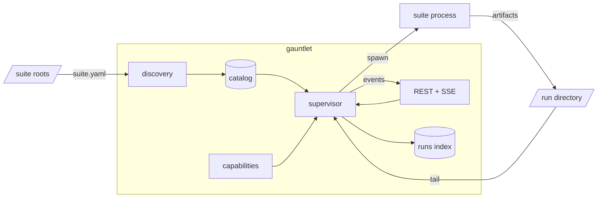

# Architecture

Gauntlet contains no suite-specific code. A suite describes itself in its
`suite.yaml`; the results it produces are a directory of files.

## Components

| Module | Responsibility |
|---|---|
| `gauntlet.suites` | Walks the suite roots, loads and validates each `suite.yaml`, lists profiles. |
| `gauntlet.supervisor` | Builds the command line, spawns the process, streams output, finalizes the run. |
| `gauntlet.capabilities` | Registers instrument providers and grants them to runs. |
| `gauntlet.conformance` | Checks a suite against the contract. |
| `gauntlet.storage` | SQLite index of run history. |
| `gauntlet.api` | REST routers, one module per resource. |

## Run lifecycle

1. The supervisor resolves the suite from the catalog and the profile from the
   suite's profile directory and the user profile directory.
2. Every entry in the suite's `requires:` list is checked against the
   capability registry. An unsatisfiable capability rejects the run.
3. Gauntlet creates `<runs>/<suite>/<run-id>/` and passes it as
   `GAUNTLET_RUN_DIR`.
4. Argv is assembled from `exec.command`, `exec.args`, and the declared
   overrides supplied with the request.
5. The process is spawned. Two threads run: one reads stdout into `test.log`
   and the event bus, one tails `metrics.jsonl`.
6. On exit, `verdict.json` determines the outcome, the event bus publishes it,
   and the run is written to the index.

An unknown suite, a missing profile, an undeclared override, or an
unsatisfiable capability rejects the request before anything is spawned.

## Packages

`gauntlet-suite` is the library suite authors install. It requires pydantic and
pyyaml.

`gauntlet` is the application. It requires FastAPI and uvicorn, and depends on
`gauntlet-suite`.

## Contract models

`gauntlet_suite.contract` defines pydantic models for the four files that cross
the process boundary: `SuiteManifest`, `Verdict`, `MetricsRecord`, and
`RunManifest`. Both packages import them.

JSON Schema is generated from these models on request — `gauntlet schema
<name>` on the command line, `GET /api/schemas/{name}` from the application.
No schema files are stored in the repository.

## Frontend data sources

The web UI renders suite-agnostic forms and views from these endpoints:

| Surface | Source |
|---|---|
| Suite list | `GET /api/suites` |
| Run form controls | `overrides[]` in each manifest, carrying type, label, unit, and choices |
| Profile editor form | `GET /api/suites/{key}/profile-schema`, produced by the suite's `exec.profile_schema_command` |
| Result views offered | `produces[]` in the manifest |
| Live run | `GET /api/runs/{id}/events` |
| History | `GET /api/runs` |
| Finished-run charts | `GET /api/runs/{id}/metrics` |
| Instrument status | `GET /api/capabilities` |

SSE event types are `status`, `log`, `metrics`, `phase`, `iteration`,
`anomaly`, `verdict`, and `end`.

## Run outcomes

| Status | Condition |
|---|---|
| `passed` | `verdict.json` has `passed: true`. |
| `failed` | `verdict.json` has `passed: false` and `aborted: false`. |
| `aborted` | `verdict.json` has `aborted: true`. |
| `error` | No `verdict.json` was written. |

Exit codes are recorded but do not determine the status.

## Stopping a run

`POST /api/runs/{id}/stop` sends the signal named in the suite's
`exec.graceful_stop_signal`, default `SIGUSR1`. `run_suite` handles it by
completing the current iteration and writing a verdict from the samples
collected. A suite declaring `NONE` escalates to an abort.

`POST /api/runs/{id}/abort` sends `SIGTERM`, then `SIGKILL` after a grace
period. No verdict is produced.

## Storage

Run artifacts on disk are the source of truth. `RunsIndex` mirrors them in
SQLite for the history view and rebuilds from disk via `import_tree`.

On startup, runs recorded as in-progress are marked interrupted, and any run
directory on disk not already indexed is imported.
